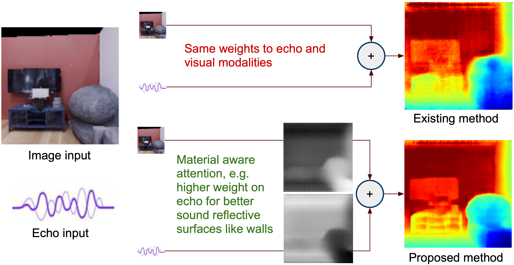

# Beyond Image to Depth: Improving Depth Prediction using Echoes (CVPR 2021)

[Kranti Kumar Parida](https://krantiparida.github.io/), [Siddharth Srivastava](), [Gaurav Sharma](https://grvsharma.com/).

We address the problem of estimating depth with multi modal audio visual data. Inspired by the ability of animals, such as bats and dolphins, to infer distance of objects with echolocation, we propose an end-to-end deep learning based pipeline utilizing RGB images, binaural echoes and estimated material properties of various objects within a scene for the task of depth estimation.

[[Project]](https://krantiparida.github.io/projects/bimgdepth.html) [[Paper]]() 



## Requirements
The code is tesed with
``` 
- Python 3.6 
- PyTorch 1.6.0
- Numpy 1.19.5
```

## Dataset

**Replica-VisualEchoes** can be obatined from [here](https://github.com/facebookresearch/VisualEchoes). We have used the 128x128 image resolution for our experiment. 

**MatterportEchoes** is an extension of existing [matterport3D](https://niessner.github.io/Matterport/) dataset. In order to obtain the raw frames please forward the access request acceptance from the authors of matterport3D dataset. We will release the procedure to obtain the frames and echoes using [habitat-sim](https://github.com/facebookresearch/habitat-sim) and [soundspaces](https://github.com/facebookresearch/sound-spaces) in near future.

## Pre-trained Model
We have provided pre-trained model for both the datasets [here](https://drive.google.com/drive/folders/1k26oP5D1YTrWIBFblySIIqZzTT6kF4yd?usp=sharing). For each of the dataset four different parts of the model are saved individually with name `rgbdepth_*`, `audiodepth_*`, `material_*`, `attention_*`, where `*` represents the name of the dataset, i.e. `replica` or `mp3d`.

## Evaluation 

To evaluate the method using the pre-trained model, download the models for the corresponding dataset and the dataset.
- Evalution for Replica dataset
```
python test.py \
--img_path path_to_img_folder \
--audio_path path_to_audio_data \
--dataset replica \
--audio_sampling_rate 44100 \
--max_depth 14.104
```
- Evaluation for Matterport3D dataset
```
python test.py \
--img_path path_to_img_folder \
--audio_path path_to_audio_data \
--dataset mp3d \
--audio_sampling_rate 16000 \
--max_depth 10.0
```


## License and Citation
The usage of this software is under [MIT License](https://github.com/krantiparida/beyond-image-to-depth/blob/c669d2164ad06290dc28d4c77de555ac2bf896d1/LICENSE).
```
@inproceedings{parida2021beyond,
  title={Beyond Image to Depth: Improving Depth Prediction using Echoes},
  author={Parida, Kranti and Srivastava, Siddharth and Sharma, Gaurav},
  booktitle={Proceedings of the IEEE/CVF conference on computer vision and pattern recognition},
  year={2021}
}
```

## Acknowledgement
We thank [Rouhan Gao](https://ai.stanford.edu/~rhgao/) for providing the initial version of the code.